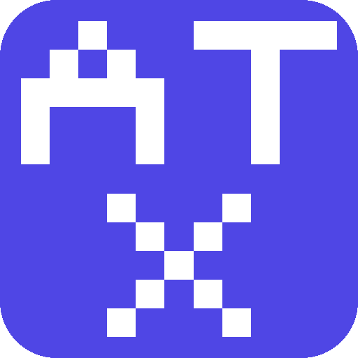

<!-- mcp-name: io.github.VibeTensor/attestix -->

<p align="center">
  
</p>

<h1 align="center">Attestix</h1>

<p align="center">
  <strong>Attestation Infrastructure for AI Agents</strong>
</p>

<p align="center">
  <a href="https://pypi.org/project/attestix/"></a>
  <a href="https://pypi.org/project/attestix/"></a>
  <a href="https://github.com/VibeTensor/attestix/blob/main/LICENSE"></a>
  <a href="https://attestix.vibetensor.com"></a>
</p>

<p align="center">
  Verifiable identity, W3C credentials, EU AI Act compliance, delegation chains,<br/>
  and reputation scoring for every AI agent. 47 MCP tools across 9 modules.
</p>

---

## Install

```bash
pip install attestix
```

## Why Attestix

On **August 2, 2026**, the EU AI Act enforcement begins. Fines reach EUR 35M or 7% of global revenue.

Existing compliance tools (Credo AI, Holistic AI, Vanta) are organizational dashboards. None produce **machine-readable, cryptographically verifiable proof** that an AI agent can present to another agent, regulator, or system.

Agent identity is fragmenting across walled gardens (Microsoft Entra, AWS AgentCore, Google A2A, ERC-8004). No single tool combines **agent identity + EU AI Act compliance + verifiable credentials** in one protocol.

Attestix fills this gap.

---

## Modules

| Module | Tools | What it does |
|--------|:-----:|-------------|
| **Identity** | 8 | Unified Agent Identity Tokens (UAITs) bridging MCP OAuth, A2A, DIDs, and API keys. GDPR Article 17 erasure |
| **Agent Cards** | 3 | Parse, generate, and discover A2A-compatible agent cards |
| **DID** | 3 | Create and resolve W3C Decentralized Identifiers (`did:key`, `did:web`) |
| **Delegation** | 4 | UCAN-style capability delegation with EdDSA-signed JWT tokens |
| **Reputation** | 3 | Recency-weighted trust scoring (0.0 - 1.0) with category breakdown |
| **Compliance** | 7 | EU AI Act risk profiles, conformity assessments (Article 43), Annex V declarations |
| **Credentials** | 8 | W3C Verifiable Credentials with Ed25519Signature2020 proofs, presentations |
| **Provenance** | 5 | Training data provenance (Article 10), model lineage (Article 11), hash-chained audit trail (Article 12) |
| **Blockchain** | 6 | Anchor artifact hashes to Base L2 via Ethereum Attestation Service, Merkle batching |

---

## Quick Start

### As an MCP Server (Claude Code)

Add to your Claude Code config (`~/.claude.json`):

```json
{
  "mcpServers": {
    "attestix": {
      "type": "stdio",
      "command": "python",
      "args": ["/path/to/attestix/main.py"]
    }
  }
}
```

Then ask Claude:

> "Create an identity for my data analysis agent with capabilities: data_analysis, reporting"

### As a Python Library

```python
from services.identity_service import IdentityService

svc = IdentityService()
agent = svc.create_identity(
    display_name="MyAgent",
    source_protocol="manual",
    capabilities=["data_analysis", "reporting"],
    description="Analyzes quarterly financial data",
    issuer_name="Acme Corp",
)

print(agent["agent_id"])   # attestix:f9bdb7a94ccb40f1
print(agent["issuer"]["did"])  # did:key:z6Mk...
```

### From Source

```bash
git clone https://github.com/VibeTensor/attestix.git
cd attestix
pip install -r requirements.txt
python main.py
```

---

## EU AI Act Compliance Workflow

Take a high-risk AI agent from zero to fully compliant:

```
1. create_agent_identity        --> UAIT with DID (Ed25519 signed)
2. record_training_data         --> Article 10 data governance
3. record_model_lineage         --> Article 11 technical documentation
4. create_compliance_profile    --> Risk categorization + obligations
5. record_conformity_assessment --> Article 43 third-party assessment
6. generate_declaration_of_conformity --> Annex V declaration + W3C VC
7. create_verifiable_presentation     --> Signed VP for regulator
```

High-risk systems are blocked from self-assessment:

```
record_conformity_assessment(assessment_type="self", ...)
--> ERROR: "High-risk AI systems require third_party conformity assessment"
```

Full walkthrough: [EU AI Act Compliance Guide](https://attestix.vibetensor.com/eu-ai-act-compliance/)

---

## How It Works

Every artifact Attestix produces is cryptographically signed with Ed25519:

| Artifact | Standard | Signed |
|----------|----------|--------|
| Agent Identity (UAIT) | Custom + DID | Ed25519 |
| Verifiable Credential | W3C VC Data Model 1.1 | Ed25519Signature2020 |
| Verifiable Presentation | W3C VP | Ed25519Signature2020 |
| Delegation Token | UCAN-style JWT | EdDSA |
| Compliance Records | EU AI Act Annex V | Ed25519 |
| Audit Trail | Hash-chained log | SHA-256 chain |
| Blockchain Anchor | EAS on Base L2 | On-chain |

**No cloud dependency.** All core operations work offline with local JSON storage.

---

## Architecture

```
attestix/
  main.py                  # MCP server entry point (47 tools)
  config.py                # Environment-based configuration
  errors.py                # Error handling with JSON logging
  auth/
    signing.py             # Ed25519 key management
    ssrf.py                # SSRF protection for outbound HTTP
  services/
    identity_service.py    # UAIT lifecycle, GDPR erasure
    agent_card_service.py  # A2A agent card operations
    did_service.py         # DID creation and resolution
    delegation_service.py  # UCAN delegation tokens
    reputation_service.py  # Trust scoring
    compliance_service.py  # EU AI Act profiles and assessments
    credential_service.py  # W3C VCs and VPs
    provenance_service.py  # Training data, lineage, audit trail
    blockchain_service.py  # Base L2 anchoring via EAS
  blockchain/
    merkle.py              # Merkle tree for batch anchoring
  tools/                   # MCP tool definitions (one file per module)
```

---

## All 47 Tools

<details>
<summary><strong>Identity</strong> (8 tools)</summary>

| Tool | Description |
|------|-------------|
| `create_agent_identity` | Create a UAIT from any identity source |
| `resolve_identity` | Auto-detect token type and register |
| `verify_identity` | Check existence, revocation, expiry, signature |
| `translate_identity` | Convert to A2A, DID Document, OAuth, or summary |
| `list_identities` | List UAITs with protocol/revocation filters |
| `get_identity` | Get full UAIT details |
| `revoke_identity` | Mark a UAIT as revoked |
| `purge_agent_data` | GDPR Article 17 right to erasure across all stores |

</details>

<details>
<summary><strong>Agent Cards</strong> (3 tools)</summary>

| Tool | Description |
|------|-------------|
| `parse_agent_card` | Parse an A2A Agent Card JSON |
| `generate_agent_card` | Generate agent.json for hosting |
| `discover_agent` | Fetch `/.well-known/agent.json` from a URL |

</details>

<details>
<summary><strong>DID</strong> (3 tools)</summary>

| Tool | Description |
|------|-------------|
| `create_did_key` | Generate ephemeral `did:key` with Ed25519 keypair |
| `create_did_web` | Generate `did:web` DID Document for self-hosting |
| `resolve_did` | Resolve any DID to its DID Document |

</details>

<details>
<summary><strong>Delegation</strong> (4 tools)</summary>

| Tool | Description |
|------|-------------|
| `create_delegation` | UCAN-style capability delegation token |
| `verify_delegation` | Verify JWT signature, expiry, structure |
| `list_delegations` | List delegations by agent and role |
| `revoke_delegation` | Revoke a delegation token |

</details>

<details>
<summary><strong>Reputation</strong> (3 tools)</summary>

| Tool | Description |
|------|-------------|
| `record_interaction` | Record outcome and update trust score |
| `get_reputation` | Get score with category breakdown |
| `query_reputation` | Search agents by reputation criteria |

</details>

<details>
<summary><strong>Compliance</strong> (7 tools)</summary>

| Tool | Description |
|------|-------------|
| `create_compliance_profile` | Create EU AI Act profile with risk categorization |
| `get_compliance_profile` | Retrieve full compliance profile |
| `update_compliance_profile` | Update an existing compliance profile |
| `get_compliance_status` | Gap analysis: completed vs missing requirements |
| `record_conformity_assessment` | Record self or third-party assessment (Article 43) |
| `generate_declaration_of_conformity` | Generate Annex V declaration + auto-issue VC |
| `list_compliance_profiles` | Filter by risk category and compliance status |

</details>

<details>
<summary><strong>Credentials</strong> (8 tools)</summary>

| Tool | Description |
|------|-------------|
| `issue_credential` | Issue W3C VC with Ed25519Signature2020 proof |
| `verify_credential` | Check signature, expiry, revocation |
| `verify_credential_external` | Verify any VC JSON from an external source |
| `revoke_credential` | Revoke a Verifiable Credential |
| `get_credential` | Get full VC details |
| `list_credentials` | Filter by agent, type, validity |
| `create_verifiable_presentation` | Bundle VCs into a signed VP for a verifier |
| `verify_presentation` | Verify a VP with embedded credentials |

</details>

<details>
<summary><strong>Provenance</strong> (5 tools)</summary>

| Tool | Description |
|------|-------------|
| `record_training_data` | Record training data source (Article 10) |
| `record_model_lineage` | Record model chain and metrics (Article 11) |
| `log_action` | Log agent action with hash-chained audit trail (Article 12) |
| `get_provenance` | Get full provenance record |
| `get_audit_trail` | Query audit log with filters |

</details>

<details>
<summary><strong>Blockchain</strong> (6 tools)</summary>

| Tool | Description |
|------|-------------|
| `anchor_identity` | Anchor identity hash to Base L2 via EAS |
| `anchor_credential` | Anchor credential hash to Base L2 via EAS |
| `anchor_audit_batch` | Merkle batch anchor of audit log entries |
| `verify_anchor` | Verify an on-chain anchor against local data |
| `get_anchor_status` | Get anchoring status for an artifact |
| `estimate_anchor_cost` | Estimate gas cost for anchoring |

</details>

---

## Standards Conformance

Every standards claim is validated by 91 automated conformance tests that run in Docker alongside the 193 existing tests (284 total). Run them yourself:

```bash
docker build -f Dockerfile.test -t attestix-bench . && docker run --rm attestix-bench
```

| Standard | What is tested | Tests |
|----------|---------------|:-----:|
| **RFC 8032 (Ed25519)** | 4 IETF canonical vectors: key derivation, signature generation (exact match), verification, tamper rejection | 18 |
| **W3C VC Data Model 1.1** | Credential structure, Ed25519Signature2020 proof, mutable field exclusion, VP structure, replay protection | 24 |
| **W3C DID Core 1.0** | `did:key` and `did:web` document structure, roundtrip resolution, Ed25519VerificationKey2020 | 16 |
| **UCAN v0.9.0** | JWT header (alg/typ/ucv), all payload fields, capability attenuation, expiry enforcement, revocation | 16 |
| **MCP Protocol** | 47 tools registered, 9 modules, async convention, snake\_case naming | 5 |

### Performance (median latency, 1000 runs)

| Operation | Latency |
|-----------|---------|
| Ed25519 key generation | 0.08 ms |
| JSON canonicalization | 0.02 ms |
| Ed25519 sign + verify | 0.28 ms |
| Identity creation | ~14 ms |
| Credential issuance | ~17 ms |
| Credential verification | ~2 ms |
| UCAN token creation | ~9 ms |

---

## Security

- **Ed25519** signatures on all UAITs, VCs, assessments, declarations, and audit entries
- **Hash-chained audit trail** with SHA-256 for tamper-evident logging
- **SSRF protection** blocks private IPs, metadata endpoints, and DNS rebinding
- **Encrypted key storage** with AES-256-GCM when `ATTESTIX_KEY_PASSWORD` is set
- Private keys never exposed in tool responses
- No external API calls required for core operations

---

## Research Paper

Attestix is described in a research paper covering system architecture, cryptographic pipeline, EU AI Act compliance automation, and evaluation with 284 automated tests.

**[Attestix: A Unified Attestation Infrastructure for Autonomous AI Agents](https://github.com/VibeTensor/attestix/blob/main/paper/attestix-paper.pdf)**
Pavan Kumar Dubasi, VibeTensor Private Limited, 2026.

### Citing Attestix

If you use Attestix in your research, please cite:

```bibtex
@article{dubasi2026attestix,
  title     = {Attestix: A Unified Attestation Infrastructure for Autonomous AI Agents},
  author    = {Dubasi, Pavan Kumar},
  year      = {2026},
  url       = {https://github.com/VibeTensor/attestix},
  note      = {Open-source. Apache License 2.0}
}
```

---

## Documentation

Full documentation at **[attestix.vibetensor.com](https://attestix.vibetensor.com)**

| Guide | Description |
|-------|-------------|
| [Getting Started](https://attestix.vibetensor.com/getting-started/) | Installation and first identity in 5 minutes |
| [EU AI Act Compliance](https://attestix.vibetensor.com/eu-ai-act-compliance/) | Step-by-step compliance workflow |
| [Risk Classification](https://attestix.vibetensor.com/risk-classification/) | How to determine your AI system's risk category |
| [Architecture](https://attestix.vibetensor.com/architecture/) | System design and data flows |
| [API Reference](https://attestix.vibetensor.com/api-reference/) | All 47 tools with parameter tables |
| [Integration Guide](https://attestix.vibetensor.com/integration-guide/) | LangChain, CrewAI, AutoGen, MCP client |
| [Configuration](https://attestix.vibetensor.com/configuration/) | Environment variables, storage, Docker |
| [Research Paper](https://attestix.vibetensor.com/research/) | Paper, citation formats, evaluation highlights |

---

## Disclaimer

Attestix generates machine-readable, cryptographically signed compliance documentation. It is a documentation and evidence tooling system. **It does not replace legal counsel, notified body assessments, or official regulatory submissions.** Always consult qualified legal professionals for compliance decisions.

---

## Contributing

See [CONTRIBUTING.md](CONTRIBUTING.md) for development setup and guidelines.

## License

Apache License 2.0. See [LICENSE](LICENSE).

---

<p align="center">
  <a href="https://vibetensor.com">
    
  </a>
</p>

<p align="center">
  Built by <a href="https://vibetensor.com">VibeTensor</a>
</p>
