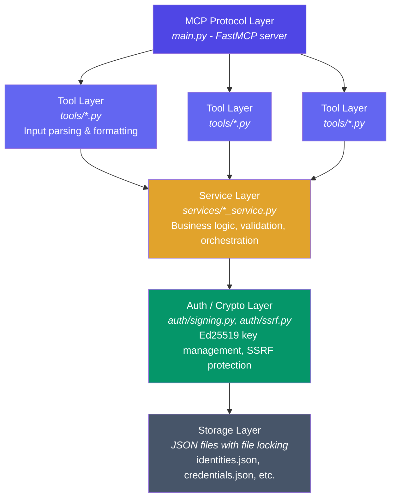
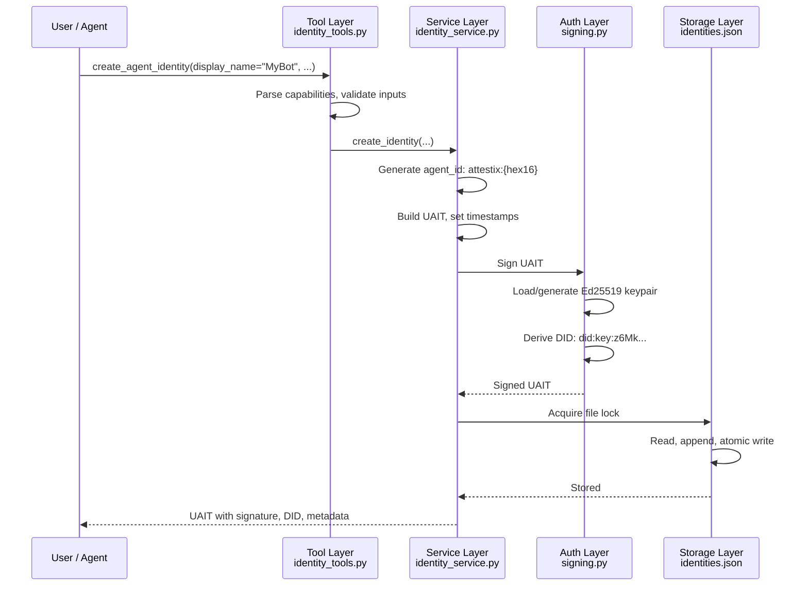
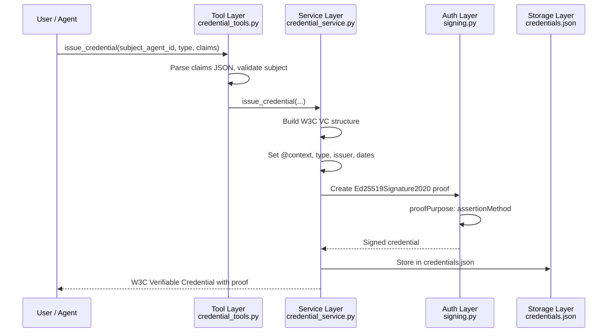
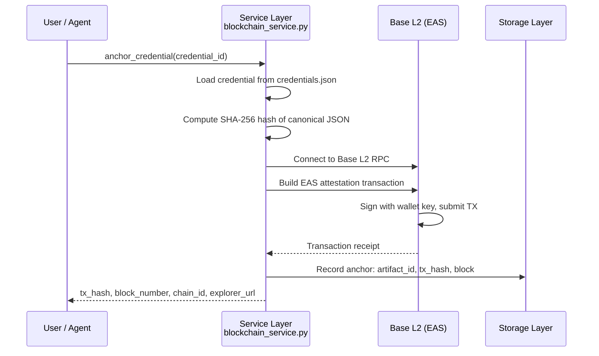

# Architecture

How Attestix is structured internally.

## Project Layout

```
attestix/
  main.py                 # MCP server entry point (registers all 47 tools)
  config.py               # Configuration loader (env vars, defaults)
  errors.py               # Custom exception hierarchy

  auth/
    signing.py            # Ed25519 key management (generation, loading, signing, verification)
    ssrf.py               # SSRF protection for outbound HTTP requests

  services/
    identity_service.py   # UAIT creation, resolution, verification, translation, GDPR erasure
    agent_card_service.py # A2A agent card parsing, generation, discovery
    did_service.py        # DID creation (did:key, did:web), resolution
    delegation_service.py # UCAN-style delegation with JWT tokens
    reputation_service.py # Recency-weighted trust scoring
    compliance_service.py # EU AI Act risk profiles, assessments, declarations
    credential_service.py # W3C Verifiable Credentials and Presentations
    provenance_service.py # Training data, model lineage, audit trail
    blockchain_service.py # On-chain anchoring via EAS on Base L2

  blockchain/
    merkle.py             # Merkle tree implementation for batch anchoring

  tools/
    identity_tools.py     # MCP tool definitions for Identity module (8 tools)
    agent_card_tools.py   # MCP tool definitions for Agent Cards module (3 tools)
    did_tools.py          # MCP tool definitions for DID module (3 tools)
    delegation_tools.py   # MCP tool definitions for Delegation module (4 tools)
    reputation_tools.py   # MCP tool definitions for Reputation module (3 tools)
    compliance_tools.py   # MCP tool definitions for Compliance module (7 tools)
    credential_tools.py   # MCP tool definitions for Credentials module (8 tools)
    provenance_tools.py   # MCP tool definitions for Provenance module (5 tools)
    blockchain_tools.py   # MCP tool definitions for Blockchain module (6 tools)

  tests/
    conftest.py           # Shared fixtures (tmp isolation, service factories)
    test_tools.py         # Integration tests for MCP tool registration
    unit/                 # Unit tests for each service module
    e2e/                  # End-to-end persona-based tests
    benchmarks/           # Standards conformance and performance benchmarks
      test_rfc8032_ed25519.py      # RFC 8032 Ed25519 test vectors
      test_w3c_vc_conformance.py   # W3C VC Data Model 1.1
      test_w3c_did_conformance.py  # W3C DID Core 1.0
      test_ucan_conformance.py     # UCAN v0.9.0
      test_mcp_conformance.py      # MCP tool registration
      test_performance.py          # Latency benchmarks
```

## Layered Architecture



## Data Flow: Identity Creation



## Data Flow: Credential Issuance



## Data Flow: Blockchain Anchoring



## Security Boundaries

| Boundary | Protection |
|----------|-----------|
| **Tool inputs** | All string inputs validated for length, format, and type. Comma-separated lists parsed safely. JSON inputs parsed with error handling. |
| **Outbound HTTP** | SSRF protection in `auth/ssrf.py` blocks requests to private IP ranges, localhost, and link-local addresses. HTTPS only for agent discovery. |
| **Signing keys** | `.signing_key.json` and `.keypairs.json` are never included in tool outputs. Files are excluded from git by default. |
| **File storage** | Cross-platform file locking prevents concurrent corruption. Atomic writes with backups protect against interrupted writes. |
| **Delegation tokens** | JWT tokens signed with EdDSA. Expiry enforced. Revocation checked on verification. Capability attenuation (delegatee cannot escalate beyond delegator's capabilities). |
| **Audit trail** | Hash-chained entries where each entry includes the hash of the previous entry. Tampering with any entry breaks the chain. |

## Configuration

Attestix uses environment variables for configuration. No config files needed. See [Configuration](configuration.md) for details.

## Testing

284 tests across unit, end-to-end, and conformance benchmark suites:

```bash
# Run all tests
pytest tests/ -v

# Run specific module tests
pytest tests/unit/test_crypto.py -v

# Run e2e persona tests
pytest tests/e2e/ -v

# Run conformance benchmarks only
pytest tests/benchmarks/ -v

# Skip blockchain tests (require funded wallet)
pytest tests/ -m "not live_blockchain" -v

# Run everything in Docker (recommended)
docker build -f Dockerfile.test -t attestix-bench . && docker run --rm attestix-bench
```

### Conformance Benchmark Suite

The `tests/benchmarks/` directory contains 91 tests that validate every standards claim:

| File | Standard | Tests |
|------|----------|:-----:|
| `test_rfc8032_ed25519.py` | RFC 8032 Section 7.1 Ed25519 vectors | 18 |
| `test_w3c_vc_conformance.py` | W3C VC Data Model 1.1 | 24 |
| `test_w3c_did_conformance.py` | W3C DID Core 1.0 | 16 |
| `test_ucan_conformance.py` | UCAN v0.9.0 | 16 |
| `test_mcp_conformance.py` | MCP tool registration | 5 |
| `test_performance.py` | Latency benchmarks with thresholds | 7 |

### Performance Thresholds

The performance benchmark enforces hard upper bounds:

| Operation | Threshold | Typical |
|-----------|-----------|---------|
| Ed25519 key generation | < 50 ms | ~0.08 ms |
| JSON canonicalization | < 10 ms | ~0.02 ms |
| Ed25519 sign + verify | < 20 ms | ~0.28 ms |
| Identity creation | < 200 ms | ~14 ms |
| Credential issuance | < 200 ms | ~17 ms |
| Credential verification | < 200 ms | ~2 ms |
| UCAN token creation | < 200 ms | ~9 ms |
