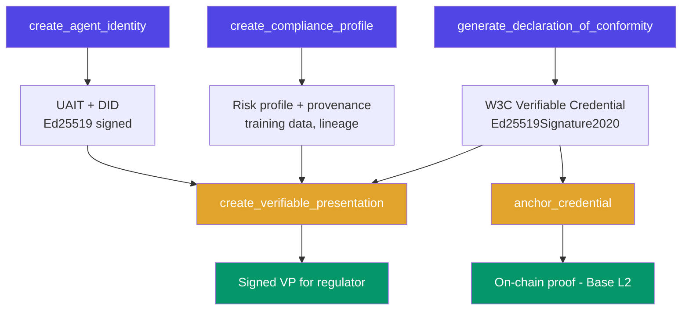

<div class="hero" markdown>

{ width="140" }

# Attestix

**Attestation Infrastructure for AI Agents**

The compliance identity layer for the EU AI Act era. Verifiable identity, W3C credentials, delegation chains, and reputation scoring for every AI agent.

[Get Started](getting-started.md){ .md-button .md-button--primary }
[API Reference](api-reference.md){ .md-button }

</div>

---

## Why Attestix Exists

On **August 2, 2026**, the EU AI Act's transparency enforcement begins. Fines reach up to EUR 35M or 7% of global revenue. Every high-risk AI system deployed in EU markets must demonstrate compliance.

Existing compliance tools (Credo AI, Holistic AI, Vanta) operate as organizational dashboards. None produce a **machine-readable, cryptographically verifiable proof** that an AI agent can present to another agent, regulator, or system.

Meanwhile, agent identity is fragmenting across walled gardens (Microsoft Entra, AWS AgentCore, Google A2A, ERC-8004). No single tool combines **agent identity + EU AI Act compliance + verifiable credentials** in one protocol.

Attestix solves this.

---

## 47 MCP Tools Across 9 Modules

| Module | Tools | Purpose |
|--------|-------|---------|
| **Identity** | 8 | Unified Agent Identity Tokens (UAITs) bridging MCP OAuth, A2A, DIDs, and API keys. GDPR Article 17 erasure |
| **Agent Cards** | 3 | Parse, generate, and discover A2A-compatible agent cards |
| **DID** | 3 | Create and resolve W3C Decentralized Identifiers (`did:key`, `did:web`) |
| **Delegation** | 4 | UCAN-style capability delegation with signed JWT tokens, revocation |
| **Reputation** | 3 | Recency-weighted trust scoring with category breakdown |
| **Compliance** | 7 | EU AI Act risk profiles, conformity assessments, Annex V declarations |
| **Credentials** | 8 | W3C Verifiable Credentials with Ed25519Signature2020, external verification |
| **Provenance** | 5 | Training data provenance, model lineage, hash-chained audit trail |
| **Blockchain** | 6 | Anchor artifact hashes to Base L2 via EAS, Merkle batch anchoring |

---

## Quick Start

=== "MCP Server (Claude Code)"

    Add to your Claude Code config:

    ```json
    {
      "mcpServers": {
        "attestix": {
          "type": "stdio",
          "command": "python",
          "args": ["/path/to/attestix/main.py"]
        }
      }
    }
    ```

    Then ask Claude:

    > "Create an identity for my data analysis agent"

=== "pip install"

    ```bash
    pip install attestix
    ```

=== "From Source"

    ```bash
    git clone https://github.com/VibeTensor/attestix.git
    cd attestix
    pip install -r requirements.txt
    python main.py
    ```

See the [Getting Started guide](getting-started.md) for full setup instructions.

---

## How It Works



---

## Key Properties

- **Local-first** - No cloud dependency. All core operations work offline with JSON file storage
- **Cryptographically signed** - Every artifact is signed with Ed25519. Anyone can verify without contacting Attestix
- **Standards-based** - W3C Verifiable Credentials, W3C DIDs, UCAN delegation, A2A agent cards
- **Vendor-neutral** - Works with any AI framework (LangChain, CrewAI, AutoGen, or plain Python)
- **EU AI Act ready** - Risk classification, conformity assessments, Annex V declarations, Article 10/11/12 documentation

---

## Important Disclaimer

Attestix generates machine-readable, cryptographically signed compliance documentation for AI agents. It is a documentation and evidence tooling system.

**Attestix does not replace legal counsel, notified body assessments, or official regulatory submissions.** Always consult qualified legal professionals for compliance decisions.

---

## License

Apache License 2.0. See [LICENSE](https://github.com/VibeTensor/attestix/blob/main/LICENSE).

---

Built by [VibeTensor](https://vibetensor.com)
