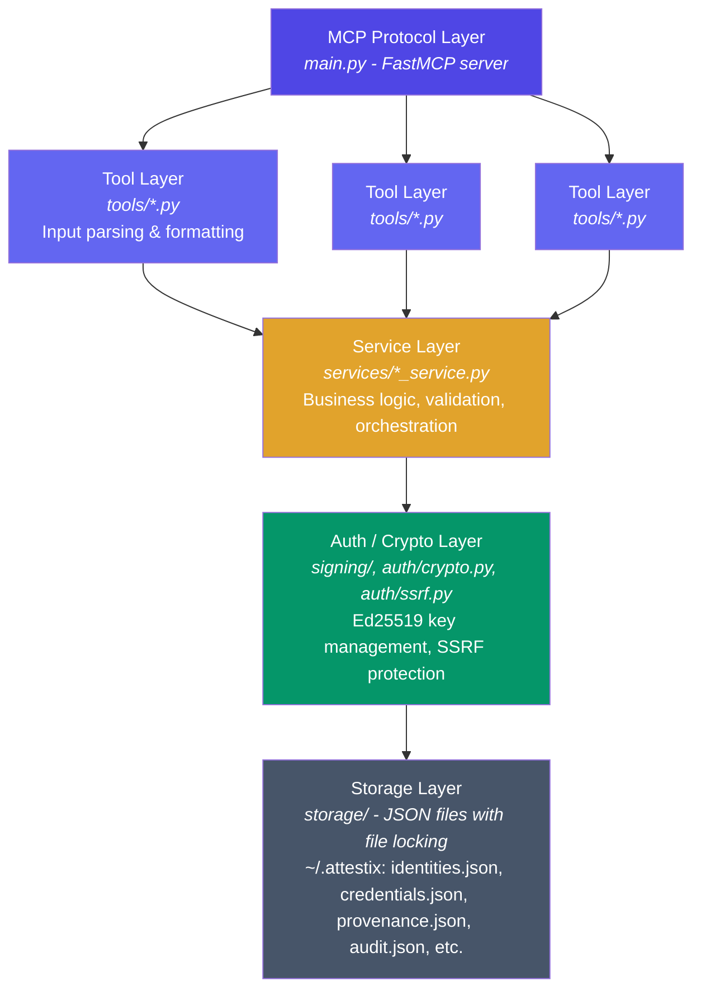
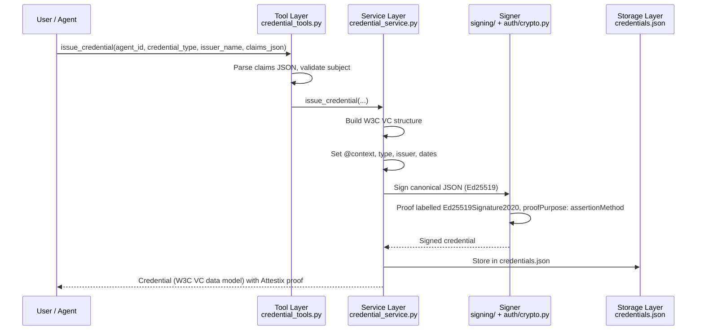
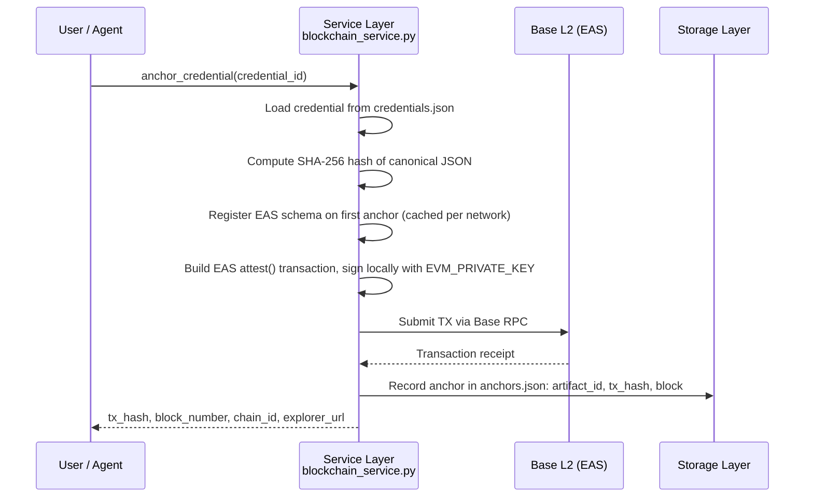

How Attestix is structured internally.

## Project Layout

```
attestix/                 # installed package (canonical attestix.* namespace)
  main.py                 # MCP server entry point, stdio only (registers all 47 tools); run: python -m attestix.main
  cli.py                  # `attestix` CLI (init, verify, compliance, audit, credential, status, list, import, export)
  config.py               # Configuration loader (env vars, data directory, JSON file paths)
  errors.py               # Error categories and error formatting helpers

  auth/
    crypto.py             # Ed25519 key management, did:key encoding, canonical JSON, sign/verify
    pqc.py                # Optional post-quantum / hybrid signing ([pqc] extra)
    ssrf.py               # SSRF protection for outbound HTTP requests
    token_parser.py       # Identity token parsing for create_identity

  signing/                # Pluggable Signer interface; default InProcessSigner (local Ed25519 key)
  storage/                # Repository interface; file-backed (JSON) and in-memory implementations
  audit/                  # Structured, hash-chained audit events (audit.json) and emitter
  tenancy/                # Tenant context
  idempotency/            # Idempotency-key store and REST middleware
  portability/            # Bundle export/import (attestix export / attestix import)
  api/                    # FastAPI REST API ([api] extra): main.py + routers/
  integrations/           # LangChain, OpenAI Agents SDK, and CrewAI helper classes

  services/
    identity_service.py   # UAIT creation, resolution, verification, translation, GDPR erasure
    agent_card_service.py # A2A agent card parsing, generation, discovery
    did_service.py        # DID creation (did:key, did:web), resolution
    delegation_service.py # UCAN-style delegation tokens (server-signed JWTs)
    reputation_service.py # Recency-weighted trust scoring
    compliance_service.py # EU AI Act risk profiles, assessments, declarations
    credential_service.py # W3C VC data model credentials and presentations (Attestix proof format)
    provenance_service.py # Training data, model lineage, audit trail
    blockchain_service.py # On-chain anchoring via EAS on Base L2 ([blockchain] extra)
    report_service.py     # Compliance reports

  blockchain/
    abi.py                # EAS contract addresses and ABI fragments
    merkle.py             # Merkle tree implementation for batch anchoring

  tools/
    identity_tools.py     # MCP tool definitions for Identity module (8 tools)
    agent_card_tools.py   # MCP tool definitions for Agent Cards module (3 tools)
    did_tools.py          # MCP tool definitions for DID module (3 tools)
    delegation_tools.py   # MCP tool definitions for Delegation module (4 tools)
    reputation_tools.py   # MCP tool definitions for Reputation module (3 tools)
    compliance_tools.py   # MCP tool definitions for Compliance module (7 tools)
    credential_tools.py   # MCP tool definitions for Credentials module (8 tools)
    provenance_tools.py   # MCP tool definitions for Provenance module (5 tools)
    blockchain_tools.py   # MCP tool definitions for Blockchain module (6 tools)

tests/                    # at the repository root, not inside the package
  conftest.py             # Shared fixtures (tmp isolation, service factories)
  test_tools.py           # Integration tests for MCP tool registration
  unit/                   # Unit tests for each service module
  integration/, e2e/, cli/, contract/, portability/, release/, install/, perf/
  benchmarks/             # Standards conformance and performance benchmarks
    test_rfc8032_ed25519.py      # RFC 8032 Ed25519 test vectors
    test_w3c_vc_conformance.py   # W3C VC Data Model 1.1 structure checks
    test_w3c_did_conformance.py  # W3C DID Core 1.0 structure checks
    test_ucan_conformance.py     # UCAN v0.9.0-style token checks
    test_mcp_conformance.py      # MCP tool registration
    test_performance.py          # Latency benchmarks
```

## Layered Architecture



## Data Flow: Identity Creation

```mermaid
sequenceDiagram
    participant U as User / Agent
    participant T as Tool Layer<br/>identity_tools.py
    participant S as Service Layer<br/>identity_service.py
    participant A as Signer<br/>signing/ + auth/crypto.py
    participant D as Storage Layer<br/>identities.json

    U->>T: create_agent_identity(display_name="MyBot", ...)
    T->>T: Parse capabilities, validate inputs
    T->>S: create_identity(...)
    S->>S: Generate agent_id: attestix:{hex16}
    S->>S: Build UAIT, set timestamps
    S->>A: Sign UAIT
    A->>A: Load/generate the server Ed25519 key
    A->>A: Server DID: did:key:z6Mk...
    A-->>S: Signed UAIT (issuer = server DID; no per-agent keypair)
    S->>D: Acquire file lock
    D->>D: Read, append, atomic write
    D-->>S: Stored
    S-->>U: UAIT with signature, server DID, metadata
```

## Data Flow: Credential Issuance



## Data Flow: Blockchain Anchoring



## Security Boundaries

| Boundary | Protection |
|----------|-----------|
| **Tool inputs** | All string inputs validated for length, format, and type. Comma-separated lists parsed safely. JSON inputs parsed with error handling. |
| **Outbound HTTP** | SSRF protection in `auth/ssrf.py` blocks requests to private IP ranges, localhost, and link-local addresses. HTTPS only for agent discovery. |
| **Signing keys** | `.signing_key.json` and `.keypairs.json` are never included in tool outputs. Files are excluded from git by default. |
| **File storage** | Cross-platform file locking prevents concurrent corruption. Atomic writes with backups protect against interrupted writes. |
| **Delegation tokens** | UCAN-style JWTs signed with EdDSA by the Attestix server key (custodial). Expiry enforced. Revocation checked on verification against the local delegation store. Capability attenuation is enforced only when a `parent_token` is supplied (the child cannot request capabilities the parent lacks); the `create_delegation` MCP tool does not take a parent token. |
| **Audit trail** | Tamper-evident, not tamper-proof. The Article 12 action log (`provenance.json`) is hash-chained per agent and each entry is signed with the server key. Structured audit events (`audit.json`) are hash-chained but not signed. Editing an entry breaks the chain on verification, but anyone with write access to the data directory and the server key could rewrite the whole chain; anchor batches on-chain if you need external evidence. |

## Configuration

Attestix uses environment variables for configuration (an optional `.env` file is also read). Data is stored under `~/.attestix` unless `ATTESTIX_DATA_DIR` is set. See [Configuration](/docs/reference/configuration) for details.

## Testing

The test suite (in `tests/` at the repository root) covers unit, integration, end-to-end, and conformance benchmark suites. Run it from a source checkout:

```bash
# Run all tests
pytest tests/ -v

# Run specific module tests
pytest tests/unit/test_crypto.py -v

# Run e2e persona tests
pytest tests/e2e/ -v

# Run conformance benchmarks only
pytest tests/benchmarks/ -v

# Skip blockchain tests (require funded wallet)
pytest tests/ -m "not live_blockchain" -v

# Run everything in Docker (recommended)
docker build -f Dockerfile.test -t attestix-bench . && docker run --rm attestix-bench
```

### Conformance Benchmark Suite

The `tests/benchmarks/` directory contains 91 tests covering the standards Attestix builds on. They test Attestix's own implementation (for example structure and field checks); they are not certification by the standards bodies:

| File | Standard | Tests |
|------|----------|:-----:|
| `test_rfc8032_ed25519.py` | RFC 8032 Section 7.1 Ed25519 vectors | 18 |
| `test_w3c_vc_conformance.py` | W3C VC Data Model 1.1 | 25 |
| `test_w3c_did_conformance.py` | W3C DID Core 1.0 | 18 |
| `test_ucan_conformance.py` | UCAN v0.9.0-style tokens | 18 |
| `test_mcp_conformance.py` | MCP tool registration | 5 |
| `test_performance.py` | Latency benchmarks with thresholds | 7 |

### Performance Thresholds

The performance benchmark enforces hard upper bounds:

| Operation | Threshold | Typical |
|-----------|-----------|---------|
| Ed25519 key generation | < 50 ms | ~0.07 ms |
| JSON canonicalization | < 10 ms | ~0.02 ms |
| Ed25519 sign + verify | < 20 ms | ~0.22 ms |
| Identity creation | < 200 ms | ~20 ms |
| Credential issuance | < 200 ms | ~21 ms |
| Credential verification | < 200 ms | ~0.5 ms |
| Delegation (UCAN-style) token creation | < 200 ms | ~16 ms |
