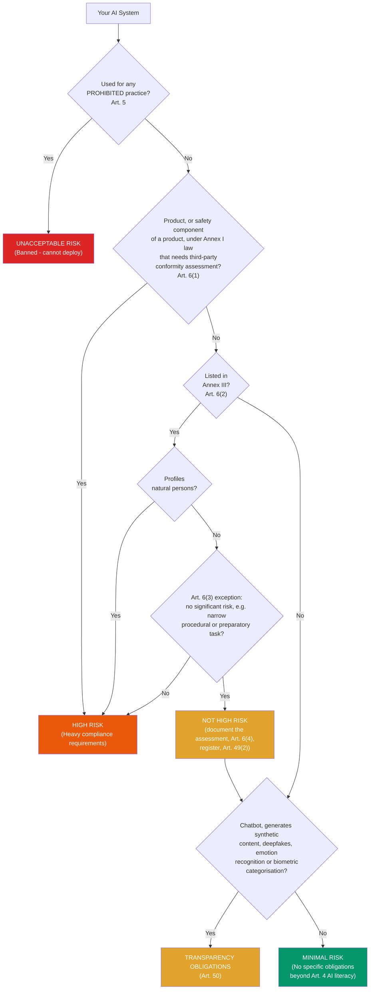

How to determine the risk category for your AI system under the EU AI Act (Regulation 2024/1689). This page is an orientation aid, not legal advice.

## Quick Decision Tree



Article 50 transparency obligations apply on top of any other category: a high-risk system that also talks to people must meet both sets of rules. Emotion recognition and biometric categorisation systems that are not prohibited are high-risk under Annex III point 1 and also carry Article 50(3) duties.

## Unacceptable Risk (PROHIBITED - Article 5)

These AI practices are banned (since 2 February 2025). Attestix cannot detect them; it only refuses to create a compliance profile with `risk_category="unacceptable"`.

- Social scoring (by public or private actors) that leads to detrimental or unfavourable treatment
- Manipulation through subliminal, purposefully manipulative, or deceptive techniques that causes significant harm
- Exploitation of vulnerabilities (age, disability, social/economic situation) that causes significant harm
- Untargeted scraping of facial images from the internet or CCTV to build facial recognition databases
- Emotion inference in the workplace or education (except for medical or safety reasons)
- Biometric categorisation inferring sensitive characteristics (race, political opinions, trade union membership, religious beliefs, sex life, sexual orientation)
- Individual predictive policing based solely on profiling or personality traits
- Real-time remote biometric identification in publicly accessible spaces for law enforcement (with narrow exceptions)
- From 2 December 2026 (Regulation (EU) 2026/1744): new prohibitions on AI practices generating non-consensual intimate imagery and child sexual abuse material

## High Risk

A system is high-risk in two ways (Article 6):

- **Article 6(1) / Annex I:** the AI system is a product, or a safety component of a product, covered by the EU product-safety legislation listed in Annex I (for example medical devices under the MDR/IVDR, machinery, toys, lifts, radio equipment) and that product needs third-party conformity assessment under that legislation. For products under Annex I Section B (for example motor vehicles, aviation, marine equipment), the AI Act requirements are applied through the sectoral type-approval rules rather than directly (Article 2(2)).
- **Article 6(2) / Annex III:** the system is used in one of the areas below.

### Annex III Categories

| Category | Examples |
|----------|---------|
| **1. Biometrics** | Remote biometric identification (1:N, identifying who someone is), biometric categorisation by sensitive or protected attributes, emotion recognition. Biometric verification whose sole purpose is confirming a person is who they claim to be (1:1, for example unlocking a phone or entering a building) is excluded. |
| **2. Critical infrastructure** | Safety components in the management and operation of critical digital infrastructure, road traffic, or the supply of water, gas, heating, or electricity |
| **3. Education & training** | Admission decisions, evaluating learning outcomes, assessing the appropriate level of education, monitoring prohibited behaviour during tests |
| **4. Employment** | CV screening, recruitment ranking, interview evaluation, promotion and termination decisions, task allocation, monitoring and evaluating performance |
| **5. Essential services** | Public benefit eligibility, creditworthiness assessment and credit scoring (fraud detection excluded), risk assessment and pricing in life and health insurance, emergency call evaluation and dispatch prioritisation |
| **6. Law enforcement** | Victim risk assessment, polygraphs and similar tools, evidence reliability assessment, offending or re-offending risk assessment, profiling during investigations |
| **7. Migration & border** | Polygraphs and similar tools, risk assessment of people entering, examining asylum, visa, and residence applications, detecting or identifying persons (travel-document verification excluded) |
| **8. Justice & democracy** | Assisting judicial authorities in researching and interpreting facts and law and applying the law, influencing the outcome of elections or referendums or voting behaviour (campaign logistics tools that people are not directly exposed to are excluded) |

### Article 6(3) exception

An Annex III system is **not** high-risk if it does not pose a significant risk of harm, for example because it only performs a narrow procedural task, improves the result of a previously completed human activity, detects decision-making patterns without replacing or influencing human assessment, or performs a preparatory task. The exception never applies if the system profiles natural persons. If you rely on it, you must document the assessment before placing the system on the market (Article 6(4)) and register the system (Article 49(2)).

### High-Risk Requirements

High-risk AI systems must meet the requirements of Articles 8-15, and their providers carry further obligations:

- Risk management system (Article 9)
- Data governance and management (Article 10)
- Technical documentation (Article 11)
- Record keeping and automatic logging (Article 12)
- Transparency and information to deployers (Article 13)
- Human oversight capability (Article 14)
- Accuracy, robustness, and cybersecurity (Article 15)
- Quality management system (Article 17)
- Conformity assessment before placing on the market or putting into service (Article 43)
- Registration in the EU database (Article 49)
- Post-market monitoring (Article 72)
- Serious incident reporting (Article 73)

### Conformity Assessment for High-Risk

The route depends on why the system is high-risk (Article 43):

- **Annex III point 1 (biometrics):** third-party assessment by a notified body (Annex VII) is needed when the provider has not applied harmonised standards or common specifications in full; otherwise the provider may choose internal control (Annex VI).
- **Annex III points 2-8:** internal control (Annex VI), with no notified body.
- **Annex I products:** the conformity assessment procedure of the relevant sectoral legislation (for example the MDR notified-body procedure), which also covers the AI Act requirements (Article 43(3)).

How Attestix handles this: when you set `annex_iii_category` on a high-risk compliance profile, `record_conformity_assessment` accepts `assessment_type="self"` for points 2-8. It always requires `third_party` for point 1 (it does not model the harmonised-standards route) and when no category is set (for example Annex I products). Known issue: the `annex_iii_exception` values `financial_fraud_detection` and `political_campaign_organization` currently force third-party assessment, but in the Act these are exclusions from Annex III points 5(b) and 8(b), not triggers for a notified body; do not use them to mean "third-party required".

## Transparency Obligations (Article 50)

These obligations apply from 2 August 2026, whatever the system's risk category:

| System Type | Required Disclosure |
|-------------|-------------------|
| AI systems interacting with people, such as chatbots (provider) | Inform people they are interacting with AI, unless obvious from the context |
| Generative AI producing audio, image, video, or text (provider) | Mark outputs in a machine-readable format as artificially generated (Art. 50(2)) |
| Emotion recognition or biometric categorisation (deployer) | Inform the people exposed to it |
| Deepfakes (deployer) | Disclose that the content is artificially generated or manipulated |
| AI-generated text published to inform the public on matters of public interest (deployer) | Disclose that it is AI-generated, unless it has undergone human review or editorial control |

## Minimal Risk

AI systems that do not fall into any of the above categories, for example:

- Spam filters
- AI in video games
- Inventory management systems
- AI-powered search (internal)
- Code completion tools
- Content recommendation (non-manipulative)

No specific requirements under the Act, apart from the Article 4 AI literacy obligation, which applies to all providers and deployers regardless of risk level. Voluntary codes of conduct are encouraged.

## Common Examples

| AI System | Risk Category | Why |
|-----------|--------------|-----|
| Medical diagnosis AI | High | Article 6(1) and Annex I: software intended for diagnosis is typically a medical device under the MDR/IVDR, and devices that need notified-body assessment are high-risk (not an Annex III category) |
| Credit scoring model | High | Annex III point 5(b) (creditworthiness) |
| Resume screening tool | High | Annex III point 4(a) (employment) |
| Customer service chatbot | Limited (transparency) | Article 50(1): interacts with people |
| AI-generated marketing images | Limited (transparency) | Article 50(2): synthetic content must be marked |
| Code completion tool (Copilot) | Minimal | Not in Annex III or Annex I |
| Email spam filter | Minimal | Not in Annex III or Annex I |
| AI-powered recommendation engine | Minimal | Unless manipulative (Article 5) |
| Face-based access control (1:1 verification) | Usually not high-risk | Biometric verification confirming a claimed identity is excluded from Annex III point 1(a); 1:N remote identification is high-risk |
| Autonomous vehicle perception | High | Article 6(1): safety component of a vehicle under Annex I Section B type-approval law, not Annex III point 2 |
| Student grading AI | High | Annex III point 3(b) (evaluating learning outcomes) |
| AI lie detector | High (or Unacceptable) | Annex III points 6(b) and 7(a) (polygraphs and similar tools); prohibited if it infers emotions in the workplace or education (Article 5(1)(f)) |

## Choosing Your Risk Category in Attestix

When creating a compliance profile, use one of these values:

```
create_compliance_profile(
  agent_id="attestix:...",
  risk_category="high",     # "minimal", "limited", or "high"
  provider_name="...",
  annex_iii_category=4,     # for Annex III systems: 1-8 (omit for Annex I products)
  ...
)
```

Attestix records the category you declare; it does not classify the system for you. If you are unsure about your risk category, consult a legal professional specialising in EU AI regulation. Incorrect classification can result in non-compliance.

## Further Reading

- [EU AI Act Full Text](https://eur-lex.europa.eu/legal-content/EN/TXT/?uri=CELEX:32024R1689)
- [EU AI Act Annex III (High-Risk Categories)](https://artificialintelligenceact.eu/annex/3/)
- [EU AI Act Article 6 (Classification Rules)](https://artificialintelligenceact.eu/article/6/)
- [EU AI Act Implementation Timeline](https://artificialintelligenceact.eu/implementation-timeline/)
