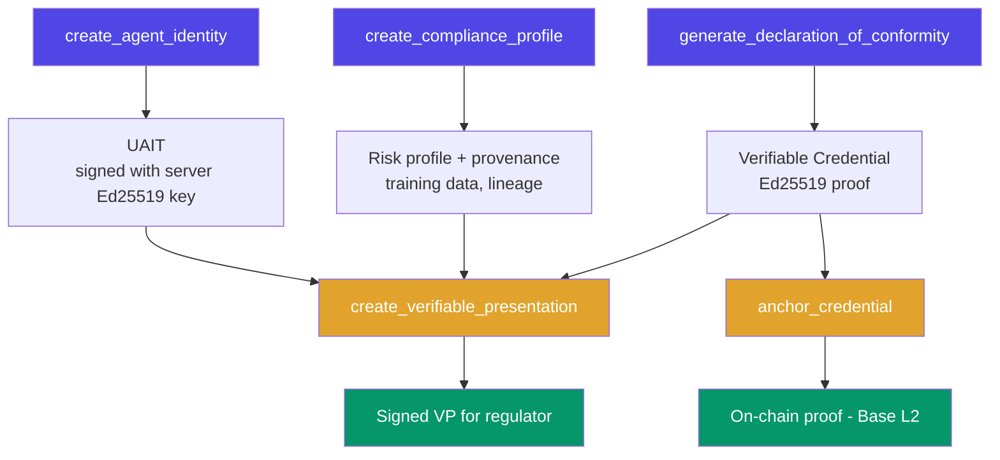

**Attestation Infrastructure for AI Agents**

The compliance identity layer for the EU AI Act era. Verifiable identity, W3C credentials, delegation chains, and reputation scoring for every AI agent.

[Get Started](/docs/getting-started) | [API Reference](/docs/reference/api-reference)

## These docs are LLM-first

Written to be read by coding agents as much as by people. Every page is also
served as raw Markdown at its URL plus `.md`, and the whole set is indexed,
one line per page, in [`/llms.txt`](/llms.txt). Hand that one link to your
agent and it can find and fetch everything else. Both are regenerated from
these pages on every build.

---

## Why Attestix Exists

From **August 2, 2026**, the EU AI Act's Article 50 transparency obligations apply. Breaching them carries fines up to EUR 15M or 3% of global revenue (Article 99(4)); prohibited practices reach EUR 35M or 7%. Annex III high-risk requirements apply from 2 December 2027 (Regulation (EU) 2026/1744).

Existing compliance tools (Credo AI, Holistic AI, Vanta) operate as organizational dashboards. None produce a **machine-readable, cryptographically verifiable proof** that an AI agent can present to another agent, regulator, or system.

Meanwhile, agent identity is fragmenting across walled gardens (Microsoft Entra, AWS AgentCore, Google A2A, ERC-8004). No single tool combines **agent identity + EU AI Act compliance + verifiable credentials** in one protocol.

Attestix solves this.

---

## 47 MCP Tools Across 9 Modules

| Module | Tools | Purpose |
|--------|-------|---------|
| **Identity** | 8 | Unified Agent Identity Tokens (UAITs) bridging MCP OAuth, A2A, DIDs, and API keys. GDPR Article 17 erasure |
| **Agent Cards** | 3 | Parse, generate, and discover A2A-compatible agent cards |
| **DID** | 3 | Create and resolve W3C Decentralized Identifiers (`did:key`, `did:web`) |
| **Delegation** | 4 | UCAN-style delegation tokens (server-signed JWTs), revocation |
| **Reputation** | 3 | Recency-weighted trust scoring with category breakdown |
| **Compliance** | 7 | EU AI Act risk profiles, conformity assessments, Annex V declarations |
| **Credentials** | 8 | Credentials in the W3C VC data model, Ed25519 proof over Attestix's RFC 8785-style canonical JSON (verify with the Attestix verifiers) |
| **Provenance** | 5 | Training data provenance, model lineage, hash-chained audit trail |
| **Blockchain** | 6 | Anchor artifact hashes to Base L2 via EAS (Sepolia by default, mainnet via `BASE_NETWORK`), Merkle batch anchoring. Needs the `[blockchain]` extra and a funded wallet |

---

## Quick Start

### MCP Server (Claude Code)

Add to your Claude Code config:

```json
{
  "mcpServers": {
    "attestix": {
      "type": "stdio",
      "command": "python",
      "args": ["-m", "attestix.main"]
    }
  }
}
```

Then ask Claude:

> "Create an identity for my data analysis agent"

### pip install

```bash
pip install attestix
```

### From Source

```bash
git clone https://github.com/VibeTensor/attestix.git
cd attestix
pip install -r requirements.txt
python -m attestix.main
```

See the [Getting Started guide](/docs/getting-started) for full setup instructions.

---

## How It Works



---

## Key Properties

- **Local-first** - No cloud dependency. All core operations work offline with JSON file storage
- **Cryptographically signed** - Identities, credentials, presentations, and delegations are signed with the server's Ed25519 key; structured audit events are hash-chained (tamper-evident, not signed). Signatures can be checked offline with the Attestix verifiers, but an offline check cannot see revocation status
- **Standards-based** - W3C Verifiable Credential and DID data models, UCAN-style delegation tokens (server-signed JWTs), A2A agent cards
- **Vendor-neutral** - Works with any AI framework (LangChain, OpenAI Agents SDK, CrewAI, or plain Python)
- **EU AI Act documentation support** - Risk classification, conformity assessment records, Annex V declarations, Article 10/11/12 evidence. It helps you document compliance; it does not make a system compliant

---

## Research Paper

Attestix is described in a research paper that covers the architecture, cryptographic pipeline, and evaluation results.

**[Attestix: A Unified Attestation Infrastructure for Autonomous AI Agents](/docs/project/research)**

Pavan Kumar Dubasi, VibeTensor Private Limited, 2026.

```bibtex
@article{dubasi2026attestix,
  title     = {Attestix: A Unified Attestation Infrastructure for Autonomous AI Agents},
  author    = {Dubasi, Pavan Kumar},
  year      = {2026},
  url       = {https://github.com/VibeTensor/attestix},
  note      = {Open-source. Apache License 2.0}
}
```

See the [Research Paper](/docs/project/research) page for full citation formats (BibTeX, APA, IEEE) and evaluation highlights.

---

## Important Disclaimer

Attestix generates machine-readable, cryptographically signed compliance documentation for AI agents. It is a documentation and evidence tooling system.

**Attestix does not replace legal counsel, notified body assessments, or official regulatory submissions.** Always consult qualified legal professionals for compliance decisions.

---

## License

Apache License 2.0. See [LICENSE](https://github.com/VibeTensor/attestix/blob/main/LICENSE).

---

Built by [VibeTensor](https://vibetensor.com)
